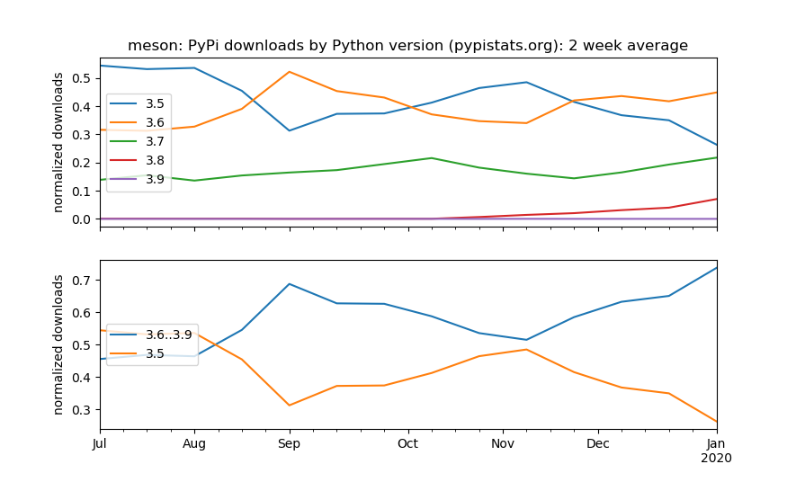

# pypistats-plots


Plots using
[pypistats library](https://github.com/hugovk/pypistats).
As it is currently, the pypistats library seems to be more "printing tables" oriented rather than "comparing plots" oriented.
Thus we created this script to plot data instead.
Our first interest in creating this addendum project was to gauge relative use of minor Python versions to decide when to cutoff EOL Python versions e.g. Python 3.5.




## Usage

There is no install--just run the script like:

```sh
python plot_pypistats.py meson
```

to plot statistics on PyPI package "Meson"
